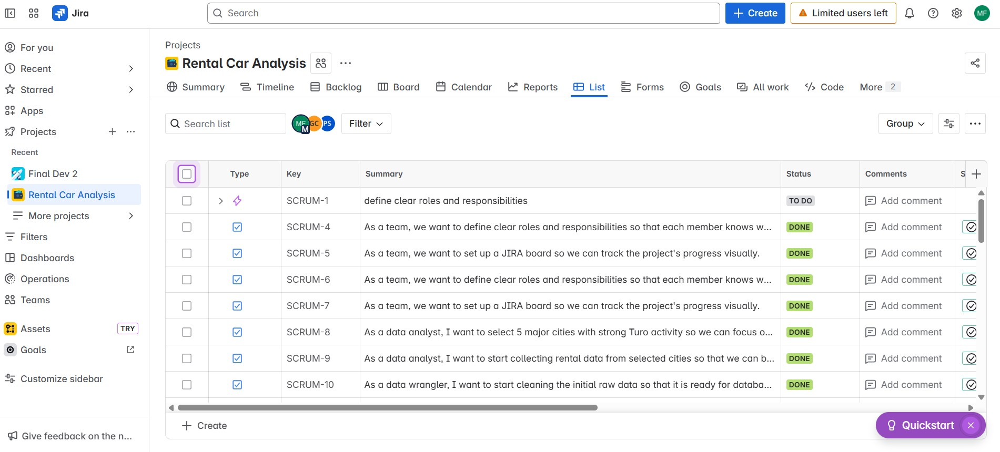

# Business Intelligence Capstone Project – Rental Car Market Analysis

**Bellevue College | Senior Business Intelligence Analyst Program**  
Author: **Mahmoud Faisal**  

---

## 📌 Project Overview
This capstone project analyzes the **rental car market** to help stakeholders make data-driven decisions regarding **fleet optimization, market entry timing, and investment strategies**.  
We applied **Agile Scrum methodology** and BI tools to collect, clean, analyze, and visualize the data.

---

## 🧑‍🤝‍🧑 Meet the Team
- **Paul Stephen** – Data Visualization Developer  
- **Mahmoud Faisal** – Data Engineer  
- **Genie Carandang** – Team Lead  

---

## 🎯 Purpose (Slide 2)
- Equip stakeholders with actionable insights.
- Optimize rental car operations.
- Identify profitable opportunities.
- Recommend **ideal locations**, **timing**, and **vehicle types**.

---

## 📂 Project Overview (Slide 3)
**Synopsis:**  
Our insights cover:
- Rental car market dynamics.
- Support for informed decisions in:
  - Fleet optimization.
  - Operational strategies.
  - Investment planning.

---

## 🎯 Objectives (Slide 4)
- Pinpoint profitable locations and vehicle types.
- Recommend optimal business launch timing.
- Provide visual dashboards for decision-making.

---

## 🛠 Tools (Slide 5)
- SQL Server (SSAS, SSIS)
- Tableau
- Excel
- JIRA

---

## 📋 Requirements Gathering & User Stories (Slides 6–7)
- Requirements gathered from stakeholders.
- User stories designed to address **market location**, **timing**, and **fleet mix**.

---

## ⚙ Agile Methodology & Scrum (Slide 8)
- Sprint planning, daily stand-ups, sprint reviews.
- Benefits:
  - Iterative development.
  - Continuous collaboration.
  - Faster value delivery.

---

## 🗂 Project Management with JIRA (Slides 9–10)
- Transparent tracking of tasks.
- Four sprints:
  1. Sprint 0 – April 21–May 4
  2. Sprint 1 – May 5–May 18
  3. Sprint 2 – May 19–June 1
  4. Sprint 3 – June 2–June 9

---

## 🖥 Design Documents (Slides 11–14)
- Use Case Diagram
- Data Flow Diagram
- OLAP UML Diagram
- Sequence Diagram

---

## 🔄 Data Pipeline (Slides 15–20)
1. Data collection from public datasets.
2. Data cleaning with SQL scripts.
3. SSAS relationships for OLAP analysis.
4. SSIS ETL workflows.

---

## 📊 Tableau Analysis & Insights (Slides 21–26)
**Vehicle Type Analysis:**  
- SUVs dominate ~50% of the rental market.

**Top SUV Models:**
- Chevy Suburban
- Chevy Tahoe
- Ford Bronco
- Jeep Wrangler
- Tesla Model Y

**Best Locations:**
- CA, CO, TN, TX

**Best Timing:**
- June/July

---

## 🧩 Blueprint for Success (Slide 27)
- Target high-demand states.
- Launch in peak season.
- Maintain SUV-heavy fleet.

---

## 💡 Reflection (Slide 28)
**What went well:**
- Clear location, timing, and model recommendations.
- Strong teamwork and Agile adoption.

**Challenges:**
- Difficulty sourcing high-quality datasets.

**Future improvements:**
- Add cost analysis.
- Integrate real-time competitor data.

---

## 📧 Author
**Mahmoud Faisal**  
Senior Business Intelligence Analyst Student | Bellevue College  
[LinkedIn](https://www.linkedin.com/) | [Email](mailto:your.email@example.com)

